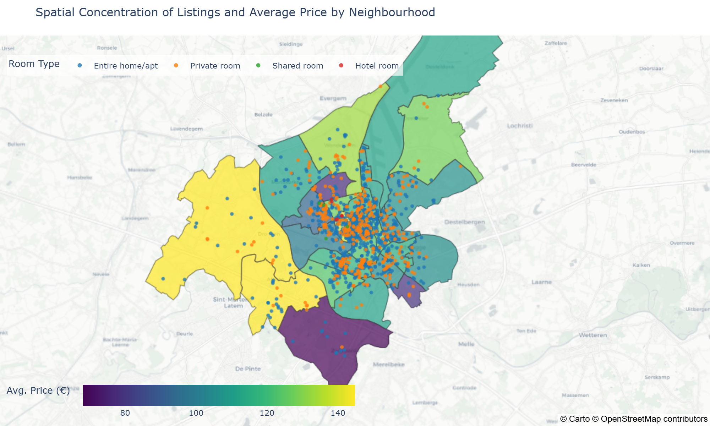
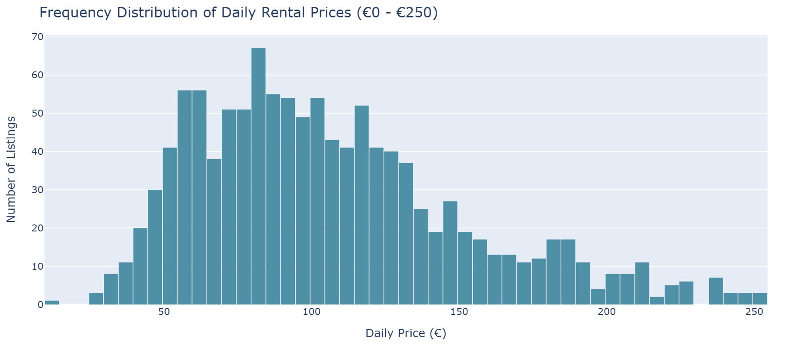
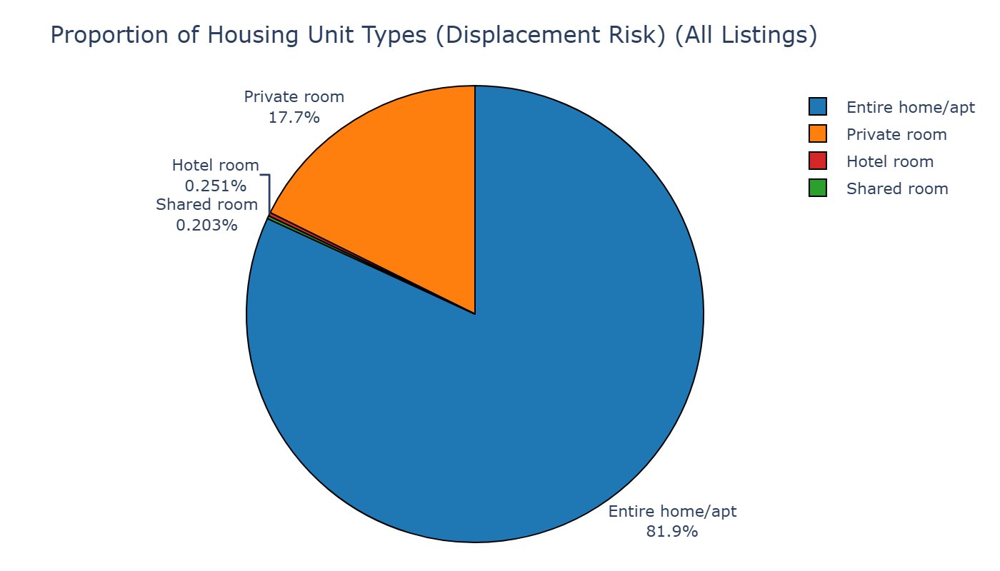
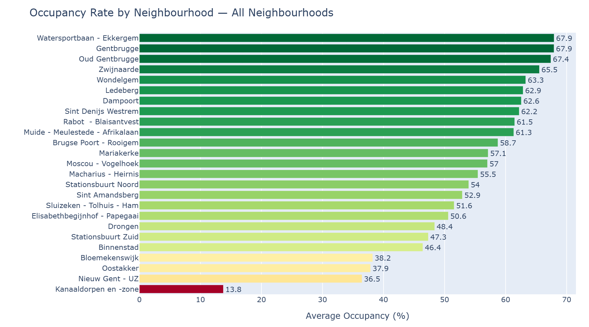
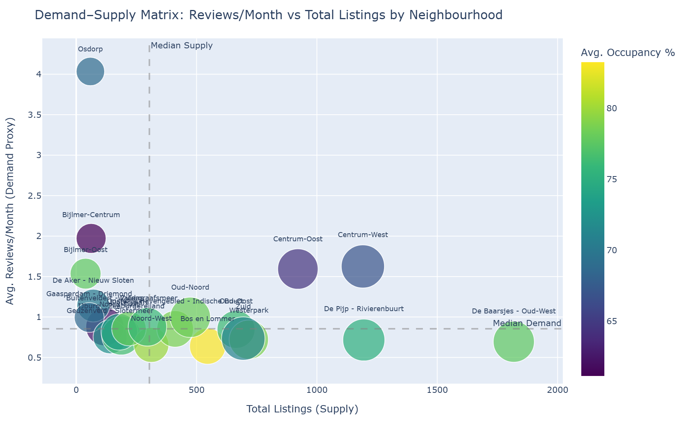
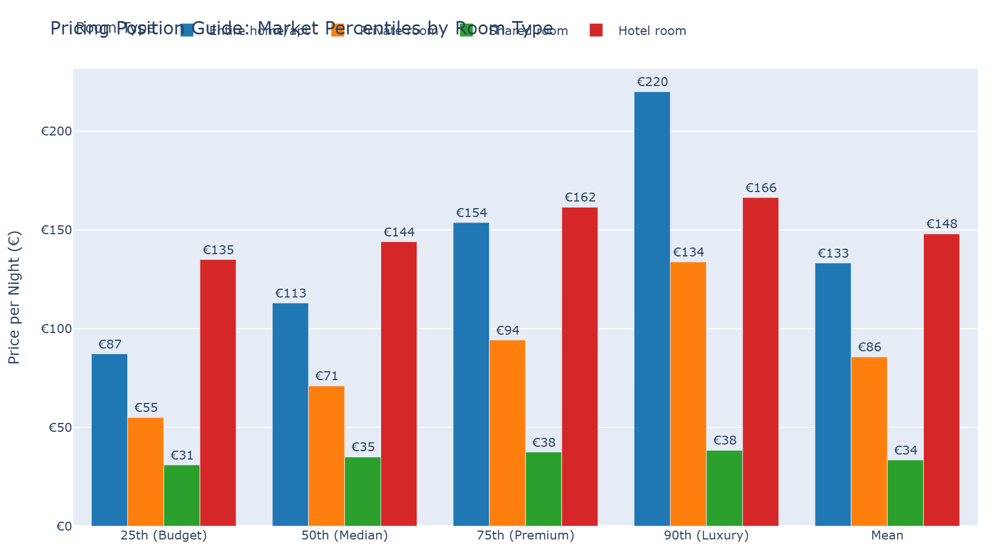
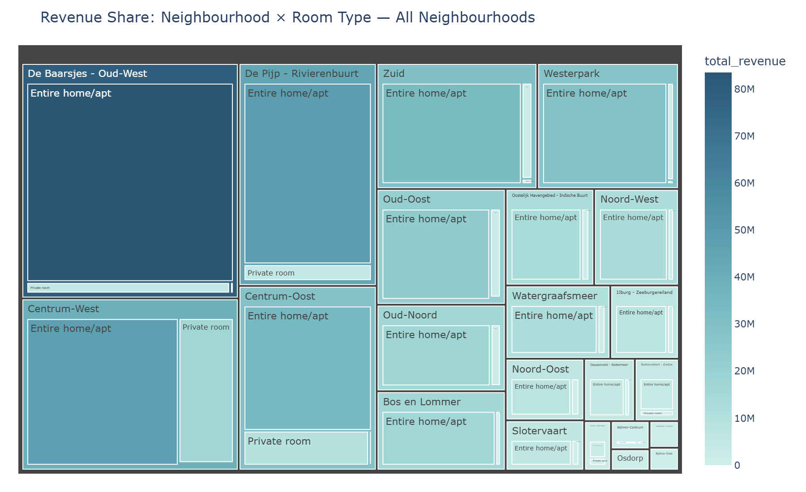
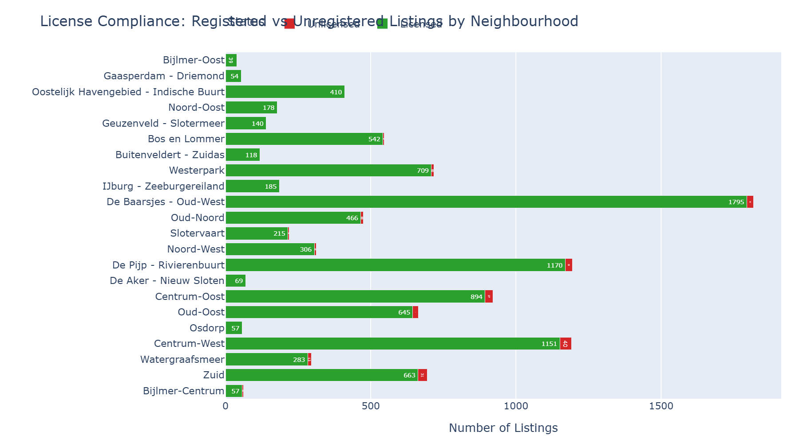
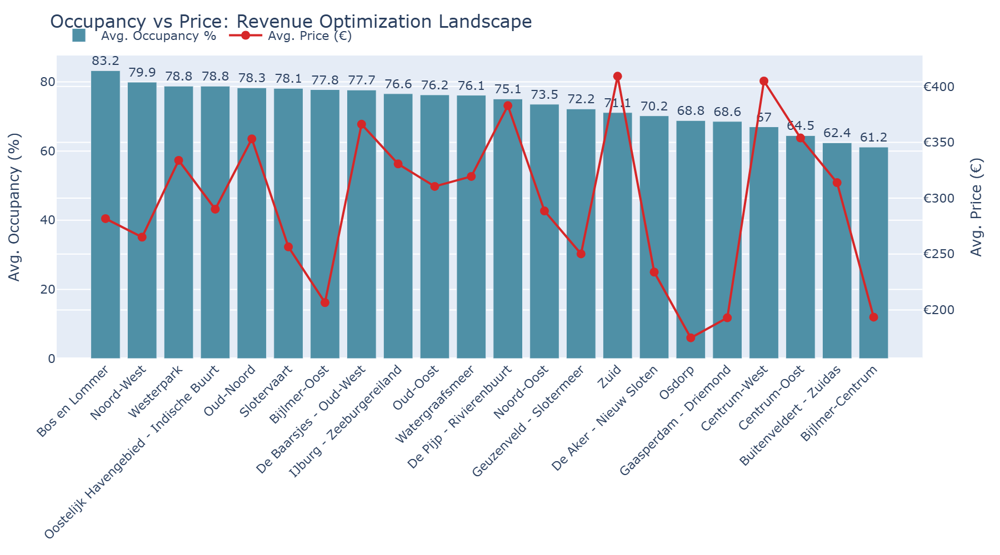

# 🏠 Inside Airbnb Amsterdam — Business Intelligence Dashboard

**Production-grade interactive analytics platform** for housing market intelligence, built with **Dash + Plotly**. Multi-tab dashboard with live refresh, KPI monitoring, and cloud deployment — designed for property owners, investors, tourism boards, and city regulators.

<p align="center">
  
</p>

---

## 🎯 Business Problems This Dashboard Solves

| Stakeholder | Problem | Solution |
|---|---|---|
| **Property Owners / Hosts** | "How should I price my listing?" | Pricing percentile guide, revenue estimation, competitive benchmarking |
| **Real Estate Investors** | "Which neighbourhood has the best ROI?" | Occupancy heat maps, demand–supply matrix, revenue treemaps |
| **Tourism Boards** | "Where are visitors concentrated?" | Demand proxy mapping, booking density, capacity planning |
| **City Regulators** | "Are short-term rentals displacing housing?" | Entire-home share tracking, license compliance monitoring, policy impact dashboards |
| **Researchers** | "What is the market structure?" | Host concentration analysis, spatial inequality measurement, pricing distribution |

---

## 📊 Dashboard Tabs

### 📍 Tab 1 — Market Overview
Price distribution histogram, room type displacement pie chart, and interactive choropleth map with master neighbourhood filter.

<p align="center">
  
  
</p>

### 💼 Tab 2 — Business Intelligence
Occupancy rates, revenue projections, demand–supply matrix, host concentration analysis, pricing position guide, and value matrix.

<p align="center">
  
  
</p>

<p align="center">
  
  
</p>

### 📋 Tab 3 — Policy & Compliance
Minimum nights distribution, license compliance tracking, occupancy–price optimization landscape, and actionable policy recommendations.

<p align="center">
  
  
</p>

---

## 🔄 Live Features

- **🟢 Auto-refresh** every 5 minutes via `dcc.Interval` — KPI cards update automatically
- **Live timestamp badge** showing last data refresh
- **6 KPI cards**: Total Listings, Avg. Price, Avg. Occupancy, Est. Annual Revenue, Entire Home Share, License Compliance

### 🔍 Tab 4 — Data Explorer (NEW)
Search, filter, sort, and export listing data. Built-in Dash DataTable with native column filtering and one-click CSV download.

### 🧮 Tab 5 — ROI Calculator + Neighbourhood Comparison (NEW)
- **Revenue Projection**: Adjust price, occupancy, and listing count — see annual/monthly revenue projections with market benchmarks
- **Side-by-Side Comparison**: Compare any two neighbourhoods across 10 KPIs (price, occupancy, revenue, compliance, host type, etc.)

---

## ☁️ Deploy Live in 60 Seconds

### Option 1: Render.com (Free — Recommended)

1. Fork this repo → [github.com/twomathematicians-code/inside-airbnb-amsterdam-dashboard](https://github.com/twomathematicians-code/inside-airbnb-amsterdam-dashboard)
2. Go to [dashboard.render.com](https://dashboard.render.com) → **New Web Service**
3. Connect your forked repo — Render auto-detects `render.yaml`
4. Click **Deploy** — live at `https://airbnb-amsterdam-dashboard.onrender.com`

> ⚠️ Free tier spins down after 15 min of inactivity. First request wakes it (takes ~30s).

### Option 2: Docker (Any Cloud)
- **Tab-independent filters** — each tab has its own neighbourhood selector

---

## ☁️ Cloud Deployment

```bash
# Docker (one command)
docker compose up -d

# Or deploy to Render.com in 60 seconds:
# 1. Fork this repo
# 2. Connect to https://dashboard.render.com
# 3. It auto-detects render.yaml
```

| Platform | Config | Status |
|---|---|---|
| **Docker** | `Dockerfile` + `docker-compose.yml` | ✅ Ready |
| **Render** | `render.yaml` (free tier) | ✅ Ready |
| **Railway** | Auto-detects Dockerfile | ✅ Compatible |
| **Fly.io** | `fly launch` from Dockerfile | ✅ Compatible |

---

## 🛠 Tech Stack

| Layer | Technology |
|---|---|
| Framework | Dash 3.x + Flask |
| Charts | Plotly Express, Plotly Graph Objects |
| UI | Dash Bootstrap Components (MINTY theme) |
| Data | Pandas, NumPy |
| Geo | GeoJSON + Mapbox |
| Deployment | Docker, Gunicorn, Render |

---

## 🚀 Quick Start

```bash
git clone https://github.com/twomathematicians-code/inside-airbnb-amsterdam-dashboard.git
cd inside-airbnb-amsterdam-dashboard/src
pip install -r requirements.txt
python app.py
# → http://localhost:8051
```

---

## 📁 Structure

```
├── README.md
├── TECHNICAL_SOP.md
├── LICENSE
├── Dockerfile
├── docker-compose.yml
├── render.yaml
├── .gitignore
├── assets/              # Chart screenshots
└── src/
    ├── app.py           # Entry point + server config
    ├── layout.py        # Multi-tab DOM composition
    ├── charts.py        # 14 chart functions + data pipeline
    ├── callbacks.py     # 15+ reactive callbacks + live refresh
    ├── export_charts.py # Screenshot generation utility
    ├── requirements.txt
    └── data/
        ├── listings.csv
        └── neighbourhoods.geojson
```

---

## 📊 Data Attribution

Data from [Inside Airbnb](http://insideairbnb.com/get-the-data.html), licensed under [CC BY 4.0](https://creativecommons.org/licenses/by/4.0/). This is an independent analysis not affiliated with Airbnb Inc.

## 🔒 License

MIT — see [LICENSE](LICENSE)
